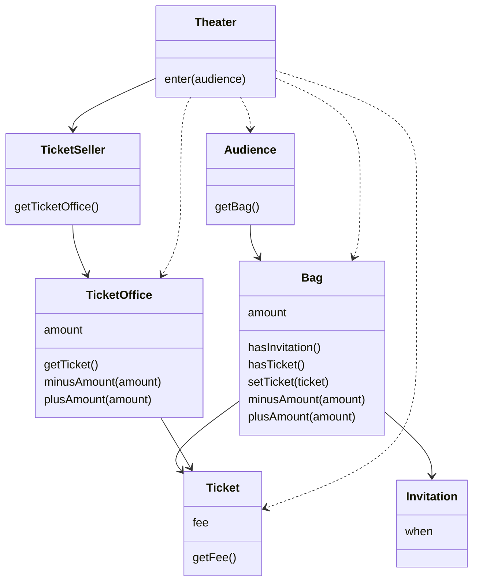
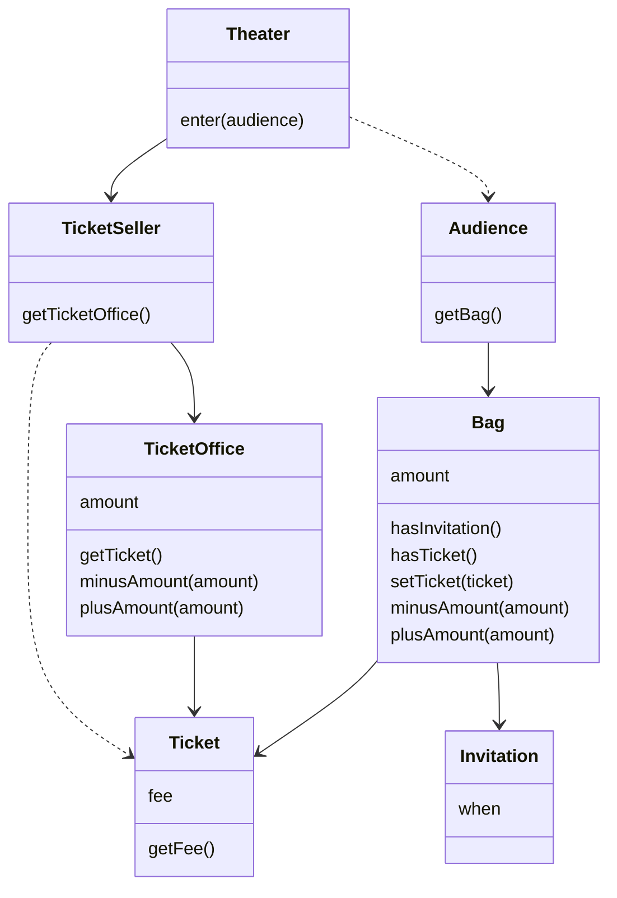

# 객체, 설계

## 무엇이 문제인가

- 첫 번째 목적은 실행 중에 제대로 동작하는 것 
- 두 번째 목적은 변경을 위해 존재하는 것 
- 세 번째 목적은 코드를 읽는 사람과 의사소통하는 것 

### 예상을 빗나가는 코드

수동적인 존재라는 점 
이해 가능한 코드란 그 동작이 우리의 예상에서 크게 벗어나지 않는 코드 
각 메서드들의 존재 유무를 아는 건 예상을 벗어나는 것이다. 

### 변경에 취약한 코드

각 메서드들을 안다는 건 변경에 취약하다는 것이다. 
안다는 건 곧 의존성을 이야기하는 것이고 이것은 변경에 대한 영향을 암시한다. 
의존성을 완전히 없애는 것이 정답은 아니다. 
서로 협력하도록 객체들의 공동체를 구축하는 것이 좋은 설계다. 
의존성이 과한 경우 <strong>결합도</strong>가 높다고 말한다. 
합리적인 수준으로 의존할 경우 결합도가 낮다고 말한다. 

## 설계 개선하기

Theater 클래스는 너무 많은 클래스에 의존하고 있다. 
단 하나만 변경하더라도 의존성이 있는 클래스들은 모두 영향을 받는다. 
설계의 목표는 객체 사이의 결합도를 낮춰 변경이 용이하게 만드는 것.  

기존 클래스 다이어그램 

Theater 가 가방과 판매원의 매표소에 직접 접근하는 것이 문제다 
가방, 판매원이 자신의 일을 스스로 처리해야 한다는 우리의 직관을 벗어난다. 
자율적인 존재로 만들자. 

### 자율성이 높이자

각각의 일을 자율적으로 처리하도록 변경한다. 
자바에서는 외부에 메서드  
<strong>캡슐화</strong>의 목적은 변경하기 쉬운 객체를 만드는 것이다. 
<u>객체 내부로 접근을 제한하고 로직을 숨기면 결합도를 낮출 수 있기 때문이다.</u> 

로직을 내부에서 처리하면 클라이언트 입장에선 해당 메시지를 통해 책임을 수행할 수 있다고만 알고 있다. 
그래서 어떻게 처리하는지 알 수 없기 때문에 결합도가 낮아진다. 
내부에 숨긴다는 건 구현체를 모르게 인터페이스만 공개하는 것과도 같다.  

개선된 후 클래스 다이어그램 

### 무엇이 개선됐는가

스스로 관리한다. 
내부 구현을 변경하더라도 클라이언트 측의 변경을 막을 수 있다. 

### 어떻게 한 것인가

자신의 문제(책임. 메시지에 대한 응답)를 스스로 해결하도록 변경. 
즉, 객체의 자율성을 보장하는(높이는) 방향으로 개선하였다. 

### 캡슐화와 응집도

객체는 객체 스스로 메시지에 응답할 수 있고 클라이언트는 원하는 결과를 반환할 것이다라는 사실만 알고 있을 뿐이다. 
연관된 작업만 수행하고, 연관성 없는 작업은 다른 객체에게 위임하는 객체를 가리켜 응집도가 높다라고 말한다. 
객체의 응집도를 높이기 위해선 스스로 자신의 책임을 수행해야 한다. 

데이터와 프로세스가 동일한 모듈 내부에 위치하도록 프로그래밍하는 방식을 객체지향 프로그래밍이라고 한다. 

### 책임의 이동

하나의 메서드는 하나의 일만 수행해야 한다. 
너무 많은 일을 하는 객체에게 책임을 분산해주자. 
적절한 객체에게 적절한 책임을 할당하는 것이 가장 좋은 설계다. 

### 🤔

1. 무엇을 챙기고 무엇을 버려야 할지 고민해 보자
2. 이야기들 속에서 반복적으로 하고자 하는 메시지가 무엇인가?
3. 객체지향을 한 줄로 요약할 수 없는 나, 비정상인가요?
