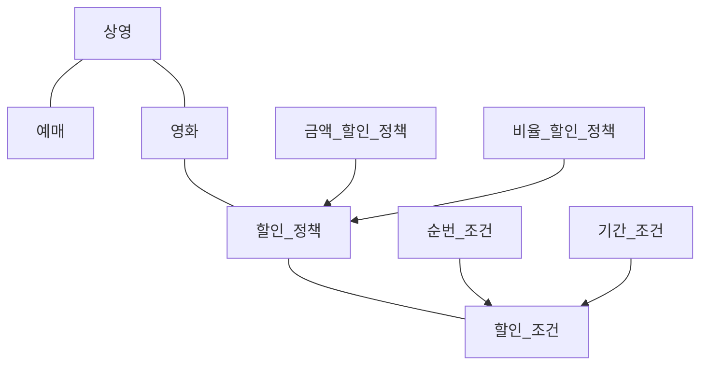

# 객체지향 프로그래밍

## 협력, 객체 클래스

- 첫째, 어떤 클래스가 필요한지 고민하기 전에 어떤 객체들이 필요한지 고민하라.<br />
- 둘째, 객체를 독립적인 존재가 아니라 기능을 구현하기 위해 협력하는 공동체의 일원으로 봐야 한다. 객체는 홀로 존재하는 것이 아니다.<br />
- 객체들의 모양과 윤곽이 잡히면 공통된 특성과 상태를 가진 객체들을 타입으로 분류하고 이 타입을 기반으로 클래스를 구현하라.<br />

### 도메인의 구조를 따르는 프로그램 구조

문제를 해결하기 위해 사용자가 프로그램을 사용하는 분야를 도메인이라고 부른다.<br />
클래스를 구현하거나, 다른 개발자에 의해 개발된 클래스를 사용할 때 가장 중요한 것은 클래스의 경계를 구분 짓는 것.<br />
경계의 명확성이 객체의 자율성을 보장하기 때문.<br />



### 자율적인 객체

- 첫 번째. 객체는 상태와 행동을 함께 가지는 복합적인 존재라는 것.<br />
- 두 번째. 객체가 스스로 판단하고 행동하는 자율적인 존재라는 것.<br />

객체에게 원하는 것을 요청하고는 객체가 스스로 최선의 방법을 결정할 수 있을 것이라는 점을 믿고 기다려야 한다.<br />
객체를 이용해 도메인의 의미를 풍부하게 표현할 수 있다는 것.<br />

### 협력에 관한 짧은 이야기

객체들은 서로 메시지를 통해 협력을 한다.<br />
요청이란 메시지에 응답을 한다.<br />
해당 응답을 처리하는 방법을 결정하는 것은 객체 스스로가 결정할 문제이다.<br />

### 추상 클래스를 이용한 TEMPLATE MATHOD 패턴

```java
import chapter02.example.condition.DiscountCondition;

public abstract class DiscountPolicy {
    private List<DiscountCondition> conditions = new ArrayList<>();

    public DiscountPolicy(DiscountCondition... conditions) {
        this.conditions = Arrays.asList(conditions);
    }

    public Money calculateDiscountAmount(Screening screening) {
        for (DiscountCondition each : conditions) {
            if (each.isSatisfiedBy(screening)) {
                return getDiscountAmount(screening);
            }
        }

        return Money.ZERO;
    }

    abstract protected Money getDiscountAmount(Screening screening);
}
```

### 상속과 다형성

Movie 클래스 어디에서도 할인 정책이 금액 할인 정책인지, 비율 할인 정책인지를 판단하지 않는다.<br />
코드 수준에서 Movice 클래스는 이 두 클래스 중 어떤 것에도 의존하지 않는다.<br />
코드의 의존성과 실행 시점의 의존성이 서로 다를 수 있다.<br />
부모 클래스와 다른 부분만을 추가해서 새로운 클래스를 쉽고 빠르게 만드는 방법을 차이에 의한 프로그래밍이라고 부른다.<br />

### 상속과 인터페이스

인터페이스는 객체가 이해할 수 있는 메시지의 목록을 정의한다는 것.<br />
객체 입장에서는 자신과 협력하는 객체가 어떤 클래스의 인스턴스인지가 중요한게 아니다.<br />
단지 메시지를 수신할 수 있다는 사실이 중요하다.<br />

### 다형성

메시지와 메서드는 다른 개념이다.<br />
연결된 객체의 클래스가 무엇인가에 따라 달라진다.<br />
동일한 메시지를 수신했을 때 객체의 타입에 따라 다르게 응답할 수 있는 능력.<br />
다형적인 협력에 참여하는 객체들은 모두 같은 메시지를 이해할 수 있어야 한다.<br />
인터페이스가 동일해야 한다는 것.<br />
상속은 구현 상속이 아니라 인터페이스 상속을 위해 사용해야 한다.<br />

### 인터페이스와 다형성

동일한 인터페이스를 공유하여 다형적인 협력에 참여할 수 있다.<br />
<strong>"메시지를 이해할 수 있기 때문에"</strong><br />

### 추상화의 힘

첫 번째. 추상화의 계층만 따로 떼어 놓고 살펴보면 요구사항의 정책을 높은 수준에서 서술할 수 있다는 것.<br />
두 번째. 추상화를 이용하면 설계가 좀 더 유연해진다는 것.<br />
추상화를 이용해 상위 정책을 기술한다는 것은 기본적인 애플리케이션의 협력 흐름을 기술한다는 것을 의미한다.<br />

### 유연한 설계

추상화를 통한 유연한 설계는 예외 사항에도 쉽게 대응할 수 있다.<br />

### 추상 클래스와 인터페이스 트레이드오프

득과 실을 따져 트레이드오프 하라.<br />

### 코드 재사용

합성은 다른 객체의 인스턴스를 자신의 인스턴스 변수로 포함해서 재사용하는 방법을 말한다.<br />

### 상속

캡슐화 위반과 유연하지 못한 설계.<br />
캡슐화 위반 : 상속을 이용하기 위해서는 부모 클래스의 내부 구조를 잘 알고 있어야 한다.<br />
부모 클래스의 구현이 자식 클래스에게 노출되기 때문에 캡슐화가 약화된다.<br />
상위 클래스와 하위 클래스가 강하게 결합되기 때문에 변경에 취약하다.<br />

### 합성

부모 클래스와 자식 클래스의 코드를 컴파일 시점에 하나의 단위로 강하게 결합하는 것은 좋지 않다.<br />
강한 결합은 캡슐화를 저해하고 설계를 유연하지 않게 한다.<br />


### 🤔

1. 상속은 무조건 안 좋다고 생각하는 나, 비정상인가요?
