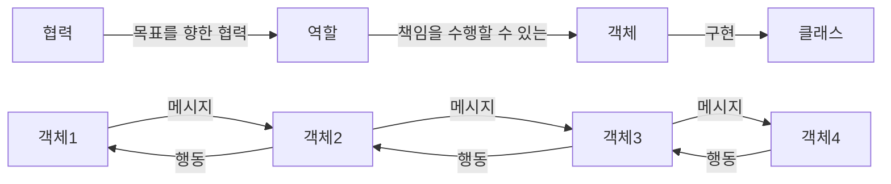

# 역할, 책임, 협력

객체지향의 본질은 협력하는 객체들의 공동체를 창조하는 것. 
객체지향 설계의 핵심은 협력을 구성하기 위해 적절한 객체를 찾고 적절한 책임을 할당하는 과정에서 드러난다. 

## 협력

객체들은 메시지를 주고 받으면서 상호작용한다. 
메시지 전송은 객체들의 협력에서 사용되는 유일한 커뮤니케이션 수단이다. 
외부의 객체는 오직 메시지만 전송할 수 있을 뿐이며 메시지를 어떻게 처리할지는 메시지를 수신한 객체가 직접 결정한다. 
자신이 할 수 없는 일을 다른 객체에게 위임하면 협력에 참옇나느 객체들의 전체적인 자율성을 향상시킬 수 있다. 
어떤 객체도 섬이 아니다. 
 🤔 
협력이라는 문맥을 고려하고 행동을 결정하라. 

## 책임

협력에 참여하기 위해 객체가 수행하는 행동. 
'무엇을 알고 있는가' 와 '무엇을 할 수 있는가'로 구성된다. 
책임 > 메시지 
자율적인 객체를 만드는 가장 기본적인 방법은 책임을 수행하는 데 필요한 정보를 가장 잘 알고 있는 전문가에게 그 책임을 할당하는 것. 
메시지가 객체를 선택한다면 장점은, 

1. 객체가 최소한의 인터페이스를 가질 수 있게 된다. 
2. 객체는 충분히 추상적인 인터페이스를 가질 수 있게 된다. 

영화 예매 시스템의 경우 '예매하라'라는 메시지를 선택하는 것으로 설계를 시작했다. 
메시지가 객체를 선택하게 하라. 
중요한 것은 객체의 상태가 아니라 행동이다. 행동이 중요하다. 
 🤔 
'무엇을 알고 있다'는 '무엇을 할 수 있다'의 재료가 된다. 
책임 주도 설계는 주고 받는 메시지의 책임을 결정해 나가며 객체들을 설계할 수 있다. 

## 역할

책임의 집합. 
역할에게 책임을 '할당'한다. 

- 추상클래스 : 책임의 일부를 구현해놓은 것. 
- 인터페이스 : 책임의 집합만을 나열한 것. 

협력은 역할들의 상호작용으로 구성되고, 협력을 구성하기 위해 역할에 적합한 객체가 선택되며, 객체는 클래스를 이용해 구현되고 생성된다. 
설계 초반은 적절한 책임과 협력의 큰 그림을 탐색하는 것이 가장 중요한 목표다. 
추상화는 상황을 단순화한다. 
역할은 협력을 추상화한다. 
추상화를 이용하면 기존 코드를 수정하지 않고도 새로운 행동을 추가할 수 있다. 

 🤔 
추상화를 통해 역할을 만든다면 대체가 가능하여 확장이 용이하다.(일종의 슬롯) 

