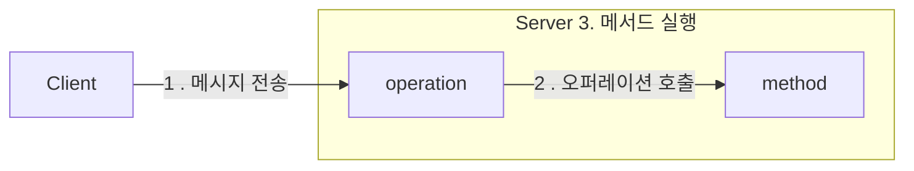

# 메시지와 인터페이스

책임이 객체가 수신할 수 있는 메시지의 기반이 된다 
객체지향 애플리케이션의 가장 중요한 재료는 객체들이 주고 받는 메시지다 

## 메시지와 메시지 전송

협력의 관점에서 객체는 두 가지 종류의 메시지 집합으로 구성된다 

1. 객체는 수신하는 메시지의 집합 
2. 외부의 객체에게 전송하는 메시지의 집합 

객체들이 협력하기 위해 사용할 수 있는 유일한 의사소통 수단 
자신이 어떤 메시지를 전송해야 하는지만 알면 된다. 
 🤔 
 

## 퍼블릭 인터페이스와 오퍼레이션

외부에 공개하는 메시지의 집합 
퍼블릭 인터페이스에 포함된 메시지를 오퍼레이션 
오퍼레이션은 수행 가능한 어떤 행동에 대한 추상화다 
오페레이션이란 실행하기 위해 객체가 호출될 수 있는 변환이나 정의에 관한 명세다 
오퍼레이션은 구현이 아닌 추상화다 

 🤔 
 

## 시그니처

오퍼레이션은 실행 코드 없이 시그니처만을 정의한 것 
메서드는 이 시그니처에 구현을 더한 것 

> #### 용어 정리
> <strong>메시지</strong> : 일반적으로 객체의 오퍼레이션이 실행되도록 요청하는 것을 '메시지 전송'이라고 부른다. 메시지는 협력에 참여하는 전송자와 수신자 양쪽 모두를 포함하는
> 개념이다.  
> <strong>오퍼레이션</strong> : 객체가 다른 객체에게 제공하는 추상적인 서비스. 오퍼레이션은 메시지를 수신하는 객체의 인터페이스를 강조한다.  
> <strong>메서드</strong> : 오퍼레이션의 구현  
> <strong>퍼블릭 인터페이스</strong> : 객체가 협력에 참여하기 위해 외부에서 수신할 수 있는 메시지의 묶음  
> <strong>시그니처</strong> : 오퍼레이션이나 메서드의 명세를 나타낸 것

 🤔 
 

## 인터페이스와 설계 품질

최소한의 인터페이스는 꼭 필요한 오퍼레이션만을 인터페이스에 포함한다 
추상적인 인터페이스는 어떻게 수행하는지가 아니라 무엇을 하는지를 표현한다 
 🤔 
 

## 디미터의 법칙

객체의 내부 구조에 강하게 결합되지 않도록 협력 경로를 제한하는 것 
내부에 대한 어떤 정보도 알지 못 한다 
협력하는 클래스의 캡슐화를 지키기 위해 접근해야 하는 요소를 제한한다 
객체는 자기 자신을 책임지는 자율적인 존재여야 한다 

> #### 아래 조건을 만족하는 인스턴스에만 메시지를 전송하라
> this 객체 
> 메서드의 매개변수 
> this의 속성 
> this의 속성인 컬렉션의 요소 
> 메서드 내에서 생성된 지역 객체 

 🤔 
 

## 묻지 말고 시켜라

객체의 외부에서 해당 객체의 상태를 기반으로 결정을 내리는 것은 객체의 캡슐화를 위반한다 
상태를 묻는 오퍼레이션을 -> 행동을 요청하는 오퍼레이션으로 바꿔라 
객체 내부를 탐색하지 않아도 된다 
 🤔 
 

## 의도를 드러내는 인터페이스

의도를 드러내는 선택자 패턴 : '어떻게' 가 아니라 '무엇'을 하는지 드러내라 
구현과 관련된 모든 정보를 캡슐화하고 객체의 퍼블릭 인터페이스에는 협력과 관련된 의도만을 표현해야 한다 
수행 방법에 관해서는 언급하지 말고 결과와 목적만을 포함하도록 클래스와 오퍼레이션의 이름을 부여하라 
 🤔 
 

## 함께 모으기

오퍼레이션의 이름은 협력이라는 문맥을 반영해야 한다 
객체 자신이 아닌 클라이언트의 의도를 표현하는 이름을 가져야 한다 
디미터 법칙은 객체 간의 협력을 설계할 때 캡슐화를 위반하는 메시지가 인터페이스에 포함되지 않도록 제한한다 
TDA는 디미터 법칙을 준수하는 협력을 만들기 위한 스타일을 제시한다 
의도를 드러내는 인터페이스 원칙은 객체의 퍼블릭 인터페이스에 어떤 이름이 드러나야 하는지에 대한 지침을 제공함으로써, 
코드의 목적을 명확하게 커뮤니케이션할 수 있게 해준다 
 🤔 
 

## 원칙의 함정

원칙이 현재 상황에 부적합하다고 판단된다면 과감하게 원칙을 무시하라 
디미터 법칙은 하나의 도트(.)를 강제하는 규칙이 아니다 
기차 충돌처럼 보여도 객체 내부 구현에 대한 어떤 정보도 외부로 노출하지 않는다면 디미터 법칙을 준수한 것 
가끔씩은 묻는 것 외에는 다른 방법이 존재하지 않는 경우도 존재한다 
자료 구조라면 당연히 내부를 노출해야 한다(디미터 법칙 적용 x) 
 🤔 
 

## 명령-쿼리 분리 원칙

프로시저, 명령 : 부수효과를 발생시키지만 값을 반환할 수 없다(객체의 상태를 변경한다면 값을 반환할 수 없다) 
함수, 쿼리 : 값을 반환하지만 부수효과를 발생시킬 수 없다(객체의 정보를 반환한다면 상태를 변경할 수 없다) 
질문이 답변을 수정해서는 안 된다 
명령과 쿼리 두 가지 역할을 동시에 수행한다면 결과를 예측하기 어렵다 
 🤔 
 

## 책임에 초점을 맞춰라

> 메시지를 먼저 선택하라. 메시지가 객체를 선택하게 하라.

#### 디미터 법칙

- 메시지를 먼저 선택한다면, 객체의 내부 구조에 대해 고민할 필요가 없어진다.
- 🤔 이래라 저래라 하지 마라

#### TDA

- 메시지를 먼저 선택한다면, 협력을 구조화하게 된다
- 🤔 명령을 해라

#### 의도를 드러내는 인터페이스

- 메시지를 먼저 선택한다면, 클라이언트의 관점에서 메시지를 선택하기 때문에 의도가 분명하다
- 🤔 추상화를 통해 인터페이스를 정의할 수 있다

#### 명령-쿼리 분리 원칙

- 메시지를 먼저 선택한다면, 협력이라는 문맥안에서 인터페이스에 관해 고민한다는 것
- 예측 가능한 협력을 만들기 위해 명령과 쿼리를 분리하게 될 것이다
- 🤔 하나의 일을 수행하게 하는 것도 이 원칙을 지키기 위한 수단이다

#### 우리에게 중요한 것은 협력에 적합한 메시지다
#### 책임 주도 설계 방법에 따라 메시지가 객체를 결정하게 하라

 🤔 
 